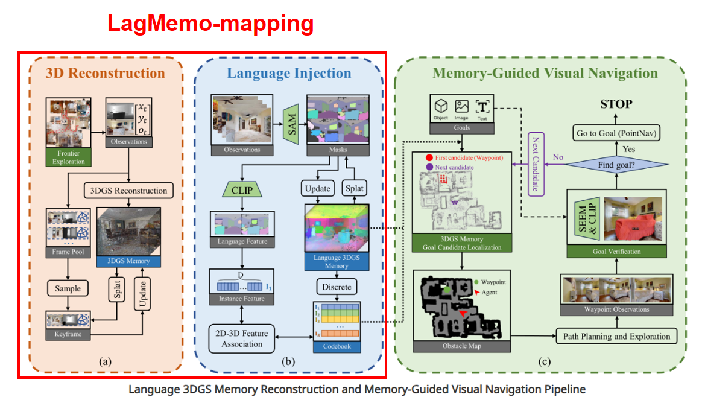
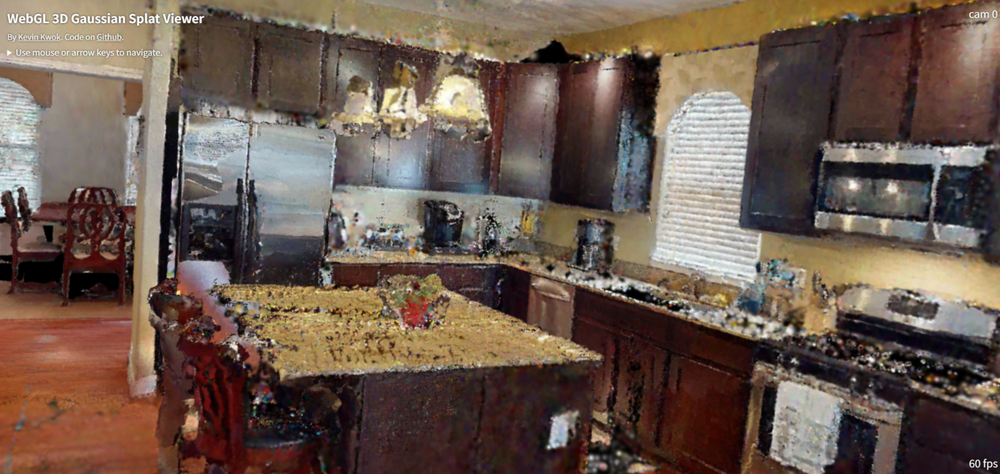
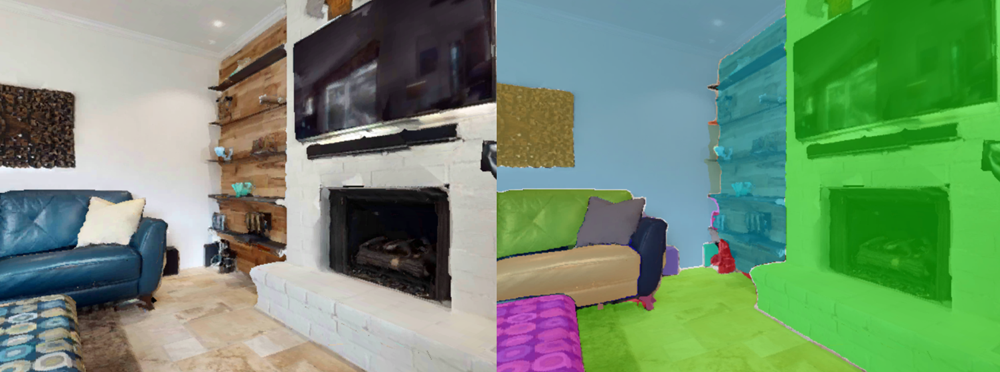

# LagMemo-mapping: Open-source Extension for 3D Reconstruction and Language Injection

This repository provides the open-source extension of **LagMemo**[https://github.com/weekgoodday/LagMemo], focusing on the previously missing semantic mapping section, including:

- **3D Reconstruction**
- **Language Injection**

The codebase is organized as an independent prelude extension around the existing LagMemo pipeline, and does not include the released part.

---

## Overview

The overall pipeline is structured into two stages:

1. **3D Reconstruction**  
   Build a 3D Gaussian Splatting (3DGS) scene representation from RGB-D observations.

2. **Language Injection**  
   Extract 2D semantic features from RGB images, then project and fuse them into the 3D scene representation.
   Use the semantic-enhanced scene representation for downstream localization and query.


---

## Repository Structure

```bash
./
├── README.md
├── 3DReconstruction/
├── LanguageInjection/
├── LagMemo/
└── your_experiment/
    ├── data/
    ├── logs/
    ├── scripts/
    │   ├── splatam_i.py
    │   ├── export_ply.py
    │   ├── process.sh
    │   ├── lagmemo.sh
    │   └── localize_new.py
    ├── configs/
    └── results/
```

---
## Dataset Preparation

**GOAT-core: A Multi-scene, Multi-modal Dataset for Downstream Target Localization Tasks.**

It is recommended to use the **GOAT-core** dataset developed by the LagMemo team. We are completely open-source and available for everyone to use for free. You can download it from **GOAT-core**(http://www.poss.pku.edu.cn/Goat-core.html) and place it in `lagmemo_mapping/your_experiment/data/`.
We also placed the `.yaml` file containing the camera intrinsic parameters at `lagmemo_mapping/your_experiment/configs/data/lagmemo640480.yaml`.

---
## Environment Setup

This part uses **two environments in total**, corresponding to different stages of the pipeline.

### 1. 3D Reconstruction Environment

`3DReconstruction` has been benchmarked with:

- Python 3.10
- PyTorch 1.12.1
- CUDA 11.6

#### Installation

```bash
git clone https://github.com/pieceHk/lagmemo_mapping

cd 3DReconstruction
conda create -n 3DReconstruction python=3.10
conda activate 3DReconstruction

conda install -c "nvidia/label/cuda-11.6.0" cuda-toolkit
conda install pytorch==1.12.1 torchvision==0.13.1 torchaudio==0.12.1 cudatoolkit=11.6 -c pytorch -c conda-forge
pip install -r requirements.txt --no-build-isolation
```

**Tips.** The `diff_gaussian_rasterization` package of 3DReconstruction encountered an error during operation. We suggest installing `torch` and then directly using:
```bash
pip install git+https://github.com/JonathonLuiten/diff-gaussian-rasterization-w-depth.git@cb65e4b86bc3bd8ed42174b72a62e8d3a3a71110 --no-build-isolation --no-cache-dir
```

---

### 2. Language Injection Environment


#### Installation

```bash
cd LanguageInjection/OpenGaussian
conda env create --file environment.yml
conda activate LanguageInjection

cd submodules
unzip ashawkey-diff-gaussian-rasterization.zip
pip install ./ashawkey-diff-gaussian-rasterization

cd ../../LangSplat
conda install -c conda-forge -y "python=3.7" "pytorch=1.12.*" "open-clip-torch<3"
pip install "ftfy" "regex" "tqdm" "huggingface_hub<0.20" "safetensors<0.4" "timm<0.9"
```

---

## Quick Start

### Step 1. Activate the 3D Reconstruction environment

```bash
conda activate 3DReconstruction
```

### Step 2. (3DReconstruction) Generate the 3DGS model

```bash
python your_experiment/scripts/splatam_i.py your_experiment/configs/splatam_new.py
```

### Step 3. (3DReconstruction) Export the PLY file

```bash
python your_experiment/scripts/export_ply.py your_experiment/configs/splatam_new.py
```
You can try visualizing the .ply file.



---

### Step 4. (LanguageInjection) Activate the Language Injection environment

```bash
conda activate LanguageInjection
```

### Step 5. (LanguageInjection) Perform 2D-level semantic segmentation and language-feature alignment

```bash
cd LangSplat
bash ../../your_experiment/scripts/process.sh
cd ..
```
You can try visualizing the results of SAM. It's a frame of 5cd in GOAT-core datasets.



### Step 6. (LanguageInjection) Generate semantic modeling results

```bash
cd OpenGaussian
bash ../../your_experiment/scripts/lagmemo.sh
```

### Step 7. (LanguageInjection) Run semantic query / localization

```bash
python query_lh/localize_new.py
```

---

## Common Issues

### 1. GPU memory usage is too high

If GPU memory usage is too high, set in your_experiment/configs/splatam_new:

```python
gt_pose = True
```

The problem may be lie in either 3D Reconstruction or 2D-to-3D lifting.

### 2. Dataset loading errors

Check the dataset path configuration in:

```bash
your_experiment/configs/splatam_new.py
```

Path misconfiguration is a common source of errors.

### 3. SSL error when downloading AlexNet weights / certificates

Possible solutions:

- Download the required files offline
- Temporarily disable SSL verification if your environment permits it

---

## Notes

- This repository is designed as an **independent extension** to the existing LagMemo release.
- The added code is relatively self-contained and does **not heavily modify** the original open-source codebase.
- In practice, only minimal integration changes be required.

---

## TODO

- [x] Reproduce the released part of the pipeline
- [x] Merge code into GitHub
- [x] Clean up scripts and configs for public release
- [x] Add checkpoints / model dependency instructions
- [ ] Add example outputs and visualization results
- [x] Add citation and license information

---

## Citation

If you find this project useful, please consider citing:

```bibtex
@misc{lagmemo_extension,
  title={LagMemo Open-source Extension},
  author={YOUR NAME},
  year={2026},
  howpublished={GitHub repository}
}
```

---

## License

This project is released under the [MIT License](LICENSE) unless otherwise specified.

> Please verify compatibility with the original LagMemo repository and all third-party dependencies before final release.

---

## Acknowledgements

This project builds upon the following components:

- LagMemo
- SplaTAM
- LangSplat
- OpenGaussian
- Segment Anything

We sincerely thank the authors of these open-source projects.
